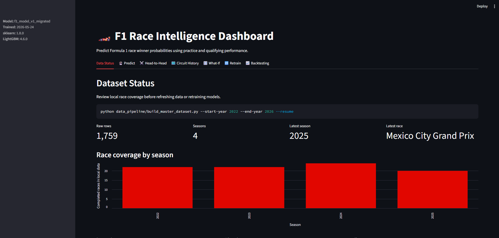
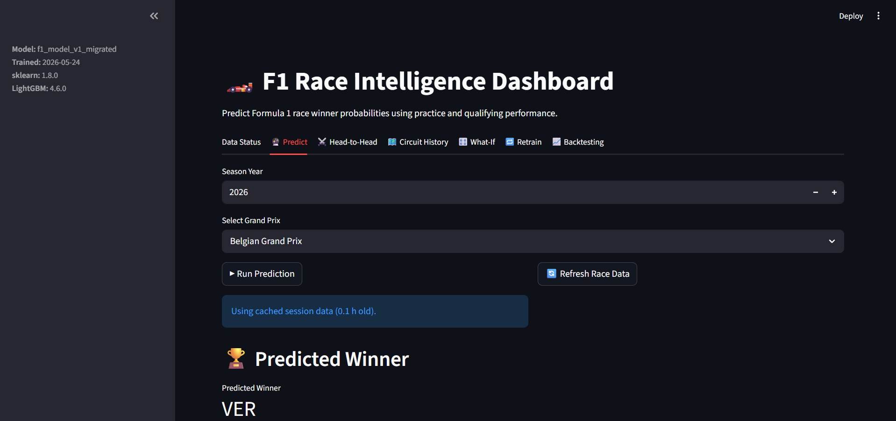

# 🏎️ F1 Race Intelligence Dashboard

> **A Formula 1 analytics platform that combines historical race data, machine learning, and interactive visualizations to predict race outcomes and analyze driver performance.**


---

# 🏁 Overview

F1 Race Intelligence Dashboard is an end-to-end motorsport analytics platform built with **Python**, **FastF1**, **LightGBM**, and **Streamlit**.

The application collects Formula 1 race weekend data, engineers performance features from practice and qualifying sessions, and predicts race winner probabilities while providing rich analytical tools for comparing drivers, circuits, and historical performance.

Rather than being a simple prediction model, the project serves as a race intelligence platform inspired by real-world Formula 1 strategy analysis.

---

# 🚀 Features

✅ Race Winner Prediction

✅ Head-to-Head Driver Comparison

✅ Circuit History Analysis

✅ What-If Strategy Simulation

✅ Historical Race Analytics

✅ Dataset Management

✅ Model Retraining

✅ Prediction Backtesting

---

# 📸 Application Preview

## 🏠 Home Dashboard



---

## 🏆 Winner Prediction


---

## ⚔️ Head-to-Head Comparison

> *(Coming Soon)*

---

## 🏁 Circuit History

> *(Coming Soon)*

---

## 📈 Backtesting

> *(Coming Soon)*

---

# 🎯 Project Objectives

The dashboard helps answer questions such as:

- Which driver has the highest probability of winning?
- How much does qualifying influence race outcomes?
- Which constructors consistently perform well at specific circuits?
- How does historical performance affect predictions?
- What happens if race conditions or grid positions change?

---

# ⚙️ Technology Stack

| Technology | Purpose |
|------------|---------|
| Python | Backend Development |
| Streamlit | Interactive Dashboard |
| FastF1 | Formula 1 Data Collection |
| Pandas | Data Analysis |
| NumPy | Numerical Computing |
| Plotly | Interactive Visualizations |
| Scikit-Learn | Data Processing |
| LightGBM | Machine Learning Model |
| Joblib | Model Serialization |

---

# 📂 Project Structure

```text
F1-Race-Intelligence-Dashboard
│
├── app.py
├── data_pipeline/
│
├── models/
│
├── dashboard/
│
├── pages/
│
├── data/
│
├── utils/
│
├── images/
│   ├── predict_dashboard.png
│   └── dataset_status.png
│
├── requirements.txt
│
└── README.md
```

---

# 🔄 Workflow

```
FastF1 API

      ↓

Practice Sessions

      ↓

Qualifying Data

      ↓

Feature Engineering

      ↓

Machine Learning Model

      ↓

Probability Prediction

      ↓

Interactive Dashboard
```

---

# 🤖 Machine Learning Pipeline

### Data Collection

- FastF1 API
- Historical race data
- Practice sessions
- Qualifying sessions
- Race results

---

### Feature Engineering

The model incorporates race weekend information including:

- Driver
- Constructor
- Circuit
- Grid Position
- Practice Performance
- Qualifying Pace
- Sector Times
- Weather Information
- Track Characteristics

---

### Model

Current Model

- **LightGBM Classifier**

Supporting Libraries

- Scikit-Learn
- Joblib

---

# 📊 Dashboard Modules

## 📌 Dataset Status

Monitor

- Race coverage
- Available seasons
- Latest completed race
- Dataset statistics

---

## 🏆 Prediction

Predicts

- Race winner
- Winning probability
- Confidence score

---

## ⚔️ Head-to-Head

Compare

- Drivers
- Constructors
- Historical performance

---

## 🏁 Circuit History

Analyze

- Previous winners
- Constructor dominance
- Circuit trends

---

## 🔄 What-If

Experiment with different race scenarios and evaluate how prediction outcomes change.

---

## 📈 Backtesting

Measure model performance using historical race weekends.

---

## 🔄 Retraining

Retrain the machine learning model as new race weekends become available.

---

# 💡 Skills Demonstrated

- API Integration
- Data Engineering
- Feature Engineering
- Machine Learning
- Predictive Analytics
- Interactive Dashboard Development
- Sports Analytics
- Model Evaluation
- Data Visualization

---

# 🔮 Future Enhancements

- Live telemetry analysis
- Tire degradation modelling
- Pit stop strategy optimization
- Weather simulation
- Safety Car impact analysis
- Championship probability simulation
- Driver pace forecasting
- Explainable AI predictions

---

# ⚙️ Installation

Clone the repository

```bash
git clone https://github.com/skyisme33/F1-Race-Intelligence-Dashboard.git
```

Install dependencies

```bash
pip install -r requirements.txt
```

Run

```bash
streamlit run app.py
```

---

# 📚 Data Source

Race weekend data is collected using the **FastF1 API**, providing historical Formula 1 practice, qualifying, and race information across multiple seasons.

---

# 👨‍💻 Author

**Aakash Chauhan**

MCA (Artificial Intelligence & Machine Learning)

Data Analytics • Machine Learning • Business Intelligence

GitHub: https://github.com/skyisme33

LinkedIn:
https://www.linkedin.com/in/aakash-chauhan-1ab0ab280/

---

⭐ If you like this project, consider giving it a star!
